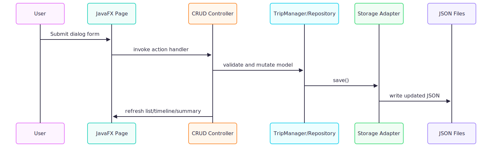

# Voyage Planner Developer Guide

Version: 1.0
Last Updated: 2026-04-17

## 1. Purpose and Scope

This guide helps a new contributor:
- set up the project from a clean machine,
- understand architecture and design rationale,
- navigate key modules and interfaces,
- run tests and validate changes,
- submit maintainable pull requests.

This document complements:
- `docs/API.md` for API-level reference,
- `docs/SDD.md` for deeper design detail,
- `docs/PRD.md` for product rationale.

## 2. Clean-Room Setup (Target: under 30 minutes)

### 2.1 Prerequisites

- OS: Windows, macOS, or Linux
- JDK 21
- Git
- RAM: 4 GB minimum, 8 GB recommended for smoother IDE + test runs
- Internet access for first Gradle dependency resolution

Project stack snapshot:
- Java: 21
- Build: Gradle wrapper
- UI: JavaFX
- JSON: Gson
- Testing: JUnit 5

### 2.2 Clone and run

```bash
# clone
git clone <repository-url>
cd CS2103DE-TP-Group-4

# run app (Windows)
gradlew.bat run

# run app (macOS/Linux)
./gradlew run
```

Expected output example:

```text
> Task :run
BUILD SUCCESSFUL
```

### 2.3 Build distributable JAR

```bash
# Windows
gradlew.bat shadowJar

# macOS/Linux
./gradlew shadowJar
```

Expected artifact:
- `build/libs/voyage-planner.jar`

Run packaged app:

```bash
java -jar build/libs/voyage-planner.jar
```

### 2.4 Run test suite

```bash
# Windows
gradlew.bat test

# macOS/Linux
./gradlew test
```

Expected report entry point:
- `build/reports/tests/test/index.html`

### 2.5 Local data model and reset behavior

Runtime data is stored in:
- `data/trips.json`
- `data/countries.json`
- `data/locations.json`
- `data/expenses.json`
- `data/images/`

To reset local state:
1. Stop the app.
2. Backup or remove files in `data/`.
3. Restart the app.

## 3. Architecture at a Glance

Voyage Planner is a layered monolith.

<p align="center">
	
</p>

### 3.1 Why this architecture

- Low operational overhead: no external DB required.
- Fast onboarding: contributors can run immediately with local files.
- Clear separation of concerns:
	- UI pages render and collect input.
	- Controllers coordinate use-cases.
	- Domain classes enforce invariants.
	- Repositories/storage isolate persistence.

### 3.2 Runtime flow for common CRUD action

<p align="center">
	
</p>

## 4. Dependency Mapping

### 4.1 Build and runtime dependencies

| Dependency | Version | Why it exists |
|---|---|---|
| `org.openjfx.javafxplugin` | `0.1.0` | JavaFX plugin integration with Gradle |
| `com.github.johnrengelman.shadow` | `7.1.2` | Build a runnable fat JAR |
| `com.google.code.gson:gson` | `2.10.1` | JSON serialization/deserialization |
| `org.openjfx:javafx-*` | `17.0.7` (per-classifier deps), `21.0.1` (plugin) | UI toolkit modules |
| `org.junit.jupiter:*` | `5.10.0` | Unit testing framework |

### 4.2 Internal dependency direction

- `ui/*` depends on domain abstractions and control coordinators.
- `ui/control/*` depends on manager/repository contracts.
- `trip/*`, `activity/*`, `expense/*`, `country/*`, `location/*` are domain-centric.
- `storage/*` depends on Gson and file APIs only.

Constraint:
- Keep `storage/*` free from JavaFX imports.
- Keep domain logic free from UI concerns.

## 5. Module and Interface Reference (Contributor-Focused)

| Module | Responsibility | Key classes |
|---|---|---|
| App bootstrap | Launch JavaFX application lifecycle | `Launcher`, `Main` |
| Main workspace | Top-level navigation and page routing | `ui.MainWindow` |
| Trip view | Trip timeline, activity list/filter, expense list/totals | `ui.TripPage` |
| Activity view | Single-activity expense operations | `ui.ActivityPage` |
| Trip orchestration | Add/edit/delete trip and orphan expense cleanup | `ui.control.MainWindowTripCrudController` |
| Lookup orchestration | Add/edit/delete country/location with reference checks | `ui.control.MainWindowLookupCrudController`, `ui.control.MainWindowReferenceInspector` |
| Domain trip service | Trip identity, overlap checks, persistence delegation | `trip.TripManager` |
| Persistence gateways | Read/write JSON and image path normalization | `storage.JsonStorage`, `storage.CountryStorage`, `storage.LocationStorage`, `storage.ExpenseStorage`, `storage.ImageAssetStore` |

## 6. Design Decisions and Rationale (Why)

### 6.1 Reference-aware deletion

Decision:
- Prevent deleting countries/locations that are still referenced.

Why:
- Avoid dangling references and silent data corruption.

Implementation notes:
- Reference scan done through `MainWindowReferenceInspector`.
- UI returns actionable messages with specific blockers.

### 6.2 Soft handling of malformed persistence input

Decision:
- JSON parse failures default to empty lists in storage adapters.

Why:
- Application remains startable even with partial/corrupt local files.

Tradeoff:
- Local data may appear missing until user restores backups.

### 6.3 Image path normalization

Decision:
- Normalize legacy and absolute image paths into canonical forms.

Why:
- Keep asset references portable across machines.
- Support older data snapshots.

## 7. Performance Constraints and Operational Limits

### 7.1 Known complexity hotspots

- Trip overlap checks in `TripManager` are pairwise.
- Activity overlap detection and lane assignment in `TripPage` are list-size dependent.

Overlap pair count scales as:

$$
comparisons = \frac{n(n-1)}{2}
$$

where $n$ is number of trips (or activities, for activity overlap scans).

Practical guidance:
- Keep very large synthetic datasets for stress testing only.
- Validate UI responsiveness after changing overlap or timeline logic.

### 7.2 Timeline rendering constants

Key constants in `TripPage`:
- `MIN_DAY_TIMELINE_WIDTH = 220.0`
- `BLOCK_HEIGHT = 42.0`
- `LANE_GAP = 10.0`
- `MIN_BLOCK_WIDTH = 16.0`

Change policy:
- If adjusted, verify desktop and narrow-window behavior manually.

## 8. Coding and Formatting Standards

- Java 21 source/target compatibility.
- Keep new logic unit-testable outside JavaFX where feasible.
- Use explicit, user-facing error messages in dialog flows.
- Preserve layering:
	- do not move storage logic into UI classes,
	- do not leak JavaFX UI types into domain packages.
- Maintain API docs alongside changed public methods.

## 9. Testing Strategy

Existing test groups are in:
- `src/test/java/activity/`
- `src/test/java/expense/`
- `src/test/java/filter/`
- `src/test/java/trip/`

### 9.1 Minimum checks before merge

1. Run all unit tests.
2. Run app manually and validate at least one end-to-end flow:
	 - Add trip -> add activity -> add expense -> restart app -> verify persistence.
3. Validate deletion safeguards:
	 - Cannot delete referenced location/country.

### 9.2 Suggested regression scenarios

1. Trip conflict handling on add/edit.
2. Activity edit with invalid time range.
3. Expense orphan cleanup after trip deletion.
4. Corrupted JSON startup behavior.

## 10. Contribution Workflow

1. Create a feature branch.
2. Implement focused changes by module.
3. Add or update tests.
4. Run `test` and manual smoke checks.
5. Update affected docs (`API.md`, `SDD.md`, this guide, or `UserGuide.md` as needed).
6. Open PR with rationale, risk notes, and validation evidence.

## 11. Definition of Done Checklist

Use this checklist for each non-trivial change:

- [ ] Build succeeds on a clean checkout.
- [ ] Unit tests pass locally.
- [ ] User-facing flow verified manually.
- [ ] Persistence behavior validated (save + reload).
- [ ] Error handling paths validated for changed logic.
- [ ] Documentation updated where behavior/contracts changed.
- [ ] No layering violations introduced.

