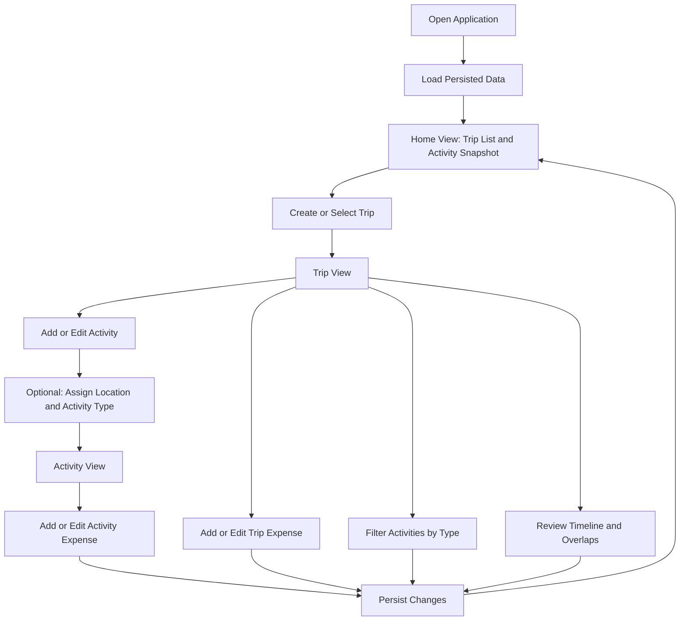
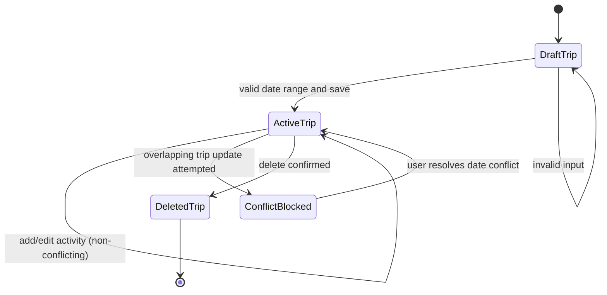
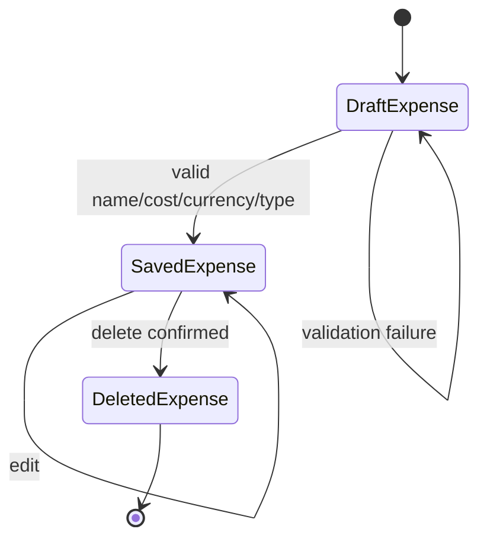

# Product Requirements Document (PRD)

## 1. Project Goals and High-Level Vision

### 1.1 Executive Summary
The product is a desktop travel planning workspace that unifies trip scheduling, activity planning, and expense tracking in a single system. It is designed to reduce planning overhead caused by fragmented tools and manual reconciliation of dates, places, and costs. The release goal is to provide a reliable, local-first planning experience with clear validations, conflict visibility, and persistent data continuity.

### 1.2 Problem Statement
Travel planning is frequently split across notes, spreadsheets, maps, and budgeting apps. This creates avoidable friction:
- schedule conflicts are discovered late,
- expense records are incomplete or hard to aggregate,
- location and destination metadata is duplicated,
- updates are difficult to keep consistent across all planning artifacts.

The system must provide one coherent planning workflow where trip timing, activities, places, and spending are managed together, with immediate feedback when user actions create invalid or conflicting states.

### 1.3 Goals
- Provide a unified planning model for trips, activities, locations, countries, and expenses.
- Reduce scheduling errors through deterministic overlap detection and clear user feedback.
- Improve planning traceability by persisting user data and media across sessions.
- Support iterative editing with predictable behavior for create, update, delete, and lookup flows.

### 1.4 Success Metrics (KPIs)
The following KPIs define product success for this release:

1. Planning completeness
- At least 80% of active users can create one full trip containing:
  - a destination country,
  - at least three activities,
  - at least three expenses,
  in one uninterrupted session.

2. Conflict prevention quality
- 100% of overlapping trip windows attempted through official CRUD flows are blocked and surfaced with user-visible error messaging.

3. Data continuity
- At least 99% of normal shutdown/restart cycles restore all previously saved entities (trips, activities, expenses, countries, locations) without user intervention.

4. Editing efficiency
- Median time to perform a standard plan adjustment (edit trip date range, update one activity, add one expense) is less than 3 minutes.

5. Error resilience
- Corrupted or incompatible persisted payloads do not crash the application at startup; startup failure rate due to malformed persisted data remains below 1%.

### 1.5 Target Audience

Primary persona: Independent travel planner
- Plans trips personally (not as an enterprise coordinator).
- Needs detailed itinerary control and date-time precision.
- Tracks expenses during planning and execution phases.
- Prefers local/offline-friendly workflows without mandatory cloud services.

Secondary persona: Budget-aware trip organizer
- Prioritizes expense visibility by category and currency.
- Needs quick review of where money is spent at trip and activity levels.

Tertiary persona: Detail-focused itinerary curator
- Wants structured locations and activity metadata.
- Needs visual timeline understanding and overlap awareness.

## 2. Comprehensive User Stories

### US-1 Create a trip
As a traveler, I want to create a trip with a date range and destination so that I can establish the main planning container.

Acceptance Criteria:
1. System allows creation with required name and valid start/end date range.
2. System rejects invalid date order with explicit error feedback.
3. System persists the created trip for future sessions.

### US-2 Prevent overlapping trips
As a traveler, I want trip-level schedule conflicts to be detected when I add or edit trips so that my macro itinerary remains coherent.

Acceptance Criteria:
1. System detects overlap with existing trip windows during add and update.
2. System blocks the operation when overlap exists.
3. System presents a clear conflict message indicating failure reason.

### US-3 Add activities to a trip
As a traveler, I want to add activities with date-time ranges so that I can build a detailed itinerary.

Acceptance Criteria:
1. System allows activity creation with required name and valid start/end date-time.
2. System supports optional location assignment.
3. New activity appears in trip activity views immediately after save.

### US-4 Categorize and filter activities
As a traveler, I want to categorize activities and filter by category so that I can focus on relevant itinerary segments.

Acceptance Criteria:
1. System supports predefined activity categories.
2. System stores selected category assignments.
3. Filtered view shows only matching activities; clearing filter restores all.

### US-5 Track trip-level expenses
As a budget-conscious traveler, I want to add expenses directly to a trip so that I can monitor overall spending.

Acceptance Criteria:
1. System captures expense name, cost, currency, and category.
2. System rejects negative cost values.
3. Expense appears in trip expense list after successful save.

### US-6 Track activity-level expenses
As a budget-conscious traveler, I want to attach expenses to specific activities so that spending context is preserved.

Acceptance Criteria:
1. System supports adding expenses within activity context.
2. System allows editing and deleting activity-linked expenses.
3. Totals by currency reflect both trip-level and activity-level spending where applicable.

### US-7 Use countries and locations as reusable references
As a traveler, I want reusable country and location records so that I do not re-enter destination metadata repeatedly.

Acceptance Criteria:
1. System supports CRUD for country and location catalogs.
2. System enforces required reference validity during assignment.
3. Deletion is blocked or guarded when references are still in active use.

### US-8 View itinerary on a timeline
As a traveler, I want a timeline representation of activities so that I can visually reason about daily schedules.

Acceptance Criteria:
1. System renders activities in temporal order within trip context.
2. Overlapping activities are visibly distinguishable.
3. Timeline updates when itinerary data changes.

### US-9 Preserve data between sessions
As a traveler, I want my planning data to persist so that I can continue planning over multiple sessions.

Acceptance Criteria:
1. System saves entities and relationships to persistent local storage.
2. System restores saved data on next launch.
3. Missing storage files are handled gracefully as empty datasets.

### US-10 Attach visual media
As a traveler, I want to associate images with destinations and expenses so that planning records are easier to recognize.

Acceptance Criteria:
1. System allows selecting local image files during relevant CRUD flows.
2. System stores normalized references to imported assets.
3. System tolerates missing or invalid image inputs without app termination.

### US-11 Safe editing workflows
As a traveler, I want editing dialogs with validation and confirmation behavior so that accidental invalid updates are minimized.

Acceptance Criteria:
1. Edit flows prefill current values where relevant.
2. Invalid inputs are rejected before final commit.
3. Cancel action leaves persisted data unchanged.

### US-12 Reliable deletion behavior
As a traveler, I want deletions to be intentional and reference-aware so that I do not accidentally corrupt my plan.

Acceptance Criteria:
1. Destructive actions require explicit user confirmation.
2. System detects active references for lookup entities before deleting.
3. Post-delete views are refreshed and remain consistent.

## 3. Functional Requirements

### 3.1 Functional Scope Overview
The product shall support:
- Trip lifecycle management.
- Activity lifecycle management within trips.
- Expense lifecycle management at trip and activity scopes.
- Country and location catalog management.
- Timeline visualization and activity filtering.
- Persistent data load/save with resilient startup behavior.

### 3.2 System Inputs and Outputs

Inputs:
- Trip fields: name, date range, destination country.
- Activity fields: name, date-time range, optional location, categories.
- Expense fields: name, amount, currency, type, optional image.
- Lookup fields: country metadata, location metadata, optional images.
- User actions: add, edit, delete, navigate, filter.

Outputs:
- Rendered lists/cards/timeline views for trips and activities.
- Currency-grouped total cost calculations.
- Conflict and validation error messages.
- Persisted local data artifacts and imported media references.

### 3.3 Business Rules

Core data validity:
1. Entity IDs must be non-negative.
2. Required names must be non-empty after trimming.
3. Priority values must be non-negative.
4. Expense cost must be non-negative.

Temporal rules:
1. Trip and activity start time must not be after end time.
2. Trip add/update operations must reject overlap with existing trips.
3. Activity overlap detection must be available for display and conflict awareness.

Reference rules:
1. Trips reference one country.
2. Activities may reference one location.
3. Locations reference one country.
4. Expense references must remain resolvable during load where possible.

Catalog rules:
1. Country and location names are uniqueness-sensitive by normalized form.
2. Deletion of lookup entities must account for active references.

### 3.4 Error Handling Requirements

Validation errors:
- Invalid input operations shall fail fast and return user-visible, actionable messages.

Lookup failures:
- Missing entity operations shall surface clear not-found outcomes.

Schedule conflicts:
- Conflicting add/update actions shall be blocked and explained.

Persistence failures:
- Read/write IO failures shall not cause silent data corruption.
- Startup parse issues in persisted files shall not terminate the application.

Media handling failures:
- Invalid image inputs shall fail gracefully with no crash and no inconsistent references.

### 3.5 Data Retention and Lifecycle

Retention baseline:
- User-created planning data persists until user-initiated deletion.

Media retention baseline:
- Imported media assets persist in local storage for ongoing references.

Corruption tolerance:
- If persisted payloads are malformed, system should start in a recoverable state and preserve whatever valid data can be restored.

Data purge:
- This version does not include automatic retention expiry or scheduled purge workflows.

## 4. Technical Constraints and Non-Functional Requirements

### 4.1 Performance
1. Interactive operations (add/edit/delete/list refresh) should complete within 1 second for typical personal-use data volumes.
2. Startup data load should complete within 3 seconds for standard datasets.
3. Timeline render updates should remain responsive under ordinary trip activity counts.

### 4.2 Scalability
1. The architecture targets single-user desktop workloads.
2. The system should remain stable under a 10x increase from baseline personal datasets, though not optimized for enterprise-scale concurrency.
3. Overlap checks and list searches should remain acceptable for intended data sizes; larger-scale optimization is deferred.

### 4.3 Security and Privacy
1. The system operates without network-authenticated identities in this release.
2. Data is stored locally; privacy boundary is the host environment.
3. Sensitive-account workflows (OAuth/JWT) are out of scope for this version.
4. Product must avoid exposing unnecessary internals in user-facing error messages where practical.

### 4.4 Compatibility
1. Primary target is desktop runtime supporting the selected UI stack.
2. Product must run consistently across supported operating systems where the runtime environment is available.
3. Data artifacts should remain portable within expected local directory conventions.

### 4.5 Reliability
1. Application should tolerate missing storage files and recover with empty initial datasets.
2. Application should avoid startup crashes due to malformed persisted payloads.
3. CRUD workflows should produce deterministic outcomes under repeated operations.

## 5. User Flow and Technical Diagrams

### 5.1 Core User Flow

### 5.2 Trip and Activity Scheduling State Diagram

### 5.3 Expense Lifecycle State Diagram

## 6. Requirement-Gathering Techniques and Provenance

The requirements in this PRD were derived using repository-driven evidence collection and synthesis.

### 6.1 Techniques Used
1. Full production source walkthrough
- Reviewed all classes in src/main/java and extracted responsibility-level behavior.

2. Class-by-class behavior abstraction
- Converted implementation details into product-level capabilities, constraints, and user outcomes.

3. Domain relationship reconstruction
- Mapped how trips, activities, expenses, countries, and locations interact and what invariants are enforced.

4. Workflow inference from UI orchestration
- Derived end-user flows from top-level controller navigation, dialog actions, and view responsibilities.

5. Error and resilience analysis
- Extracted failure modes from validation paths, checked exceptions, and storage behavior.

### 6.2 Artifacts Produced During Analysis
- .AI/CLASS_KEY_ASPECTS.md: one-by-one class key aspects for all production files.
- .AI/PROJECT_FOUNDATION.md: condensed product foundation and release direction.

### 6.3 Provenance Notes
- No external stakeholder interviews were available in this drafting cycle.
- No competitive benchmarking artifacts were present in the current repository.
- Requirements are therefore grounded in observed current behavior and release-oriented product interpretation of that behavior.

## 7. Out of Scope (Non-Goals)

The following are explicitly excluded from this release:

1. Cloud synchronization and cross-device account sync.
2. Multi-user collaboration, shared editing, and role-based permissions.
3. External booking integrations (airlines, hotels, transport providers).
4. Real-time currency conversion and exchange-rate ingestion.
5. Automatic budget recommendation engine and predictive alerts.
6. Full mobile client parity.
7. Advanced analytics dashboards beyond current planning views.
8. Automated media cleanup and historical asset lifecycle management.

## 8. Release Focus Recommendation

Current recommendation for this project:
- Prioritize product-level UX reliability and planning flow clarity over API integration expansion.
- Keep emphasis on local-first planning quality, conflict prevention, and consistent CRUD behavior.

Rationale:
- The present architecture is centered on desktop, local persistence, and direct user planning workflows.
- API-centric expansion would be a separate initiative and should be scoped with dedicated integration requirements in a subsequent PRD or addendum.

## 9. Open Product Questions for Next Iteration

1. Should activity overlap remain informational in timeline views, or become strictly blocked at creation/update time?
2. Should multi-currency totals remain separated by currency, or should conversion support be introduced?
3. Should country be mandatory on trip creation, or is an unspecified fallback acceptable long-term?
4. Should location coordinates be mandatory for certain activity types that rely on map-like reasoning?
5. What is the target maximum dataset size for sustained responsiveness on timeline rendering?

