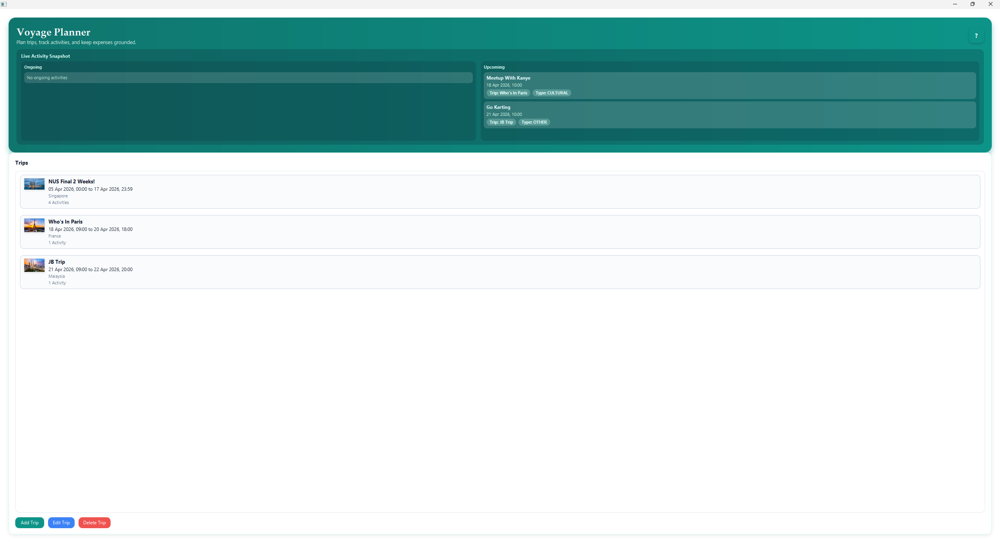
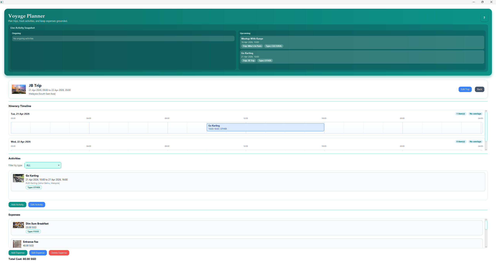
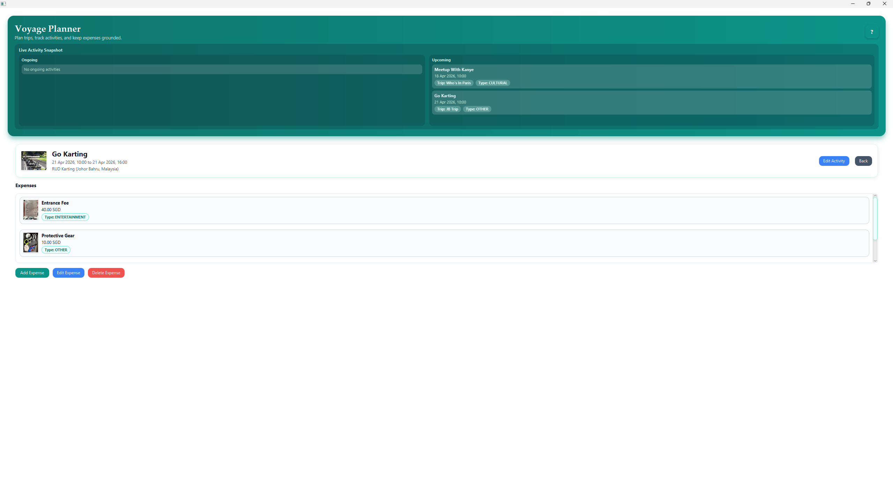

# Voyage Planner

Plan trips, activities, and expenses in one local-first desktop app built for fast, reliable travel planning.


<p align="center">
	
</p>

## Why Voyage Planner

Voyage Planner is a desktop travel-planning system that keeps itinerary planning and expense tracking in a single workflow.
It is optimized for local reliability, clear user actions, and fast iteration for software engineering teams.

## Feature Highlights

### Planning and Itinerary Management

- Create, edit, and delete trips with date-bound validation and conflict detection.
- Build activity-level itineraries per trip with timeline visibility.
- Filter activities by type for focused planning.

### Cost Tracking and Budget Visibility

- Track expenses at both trip level and activity level.
- Automatic total-cost refresh grouped by currency.
- Expense image support for receipt-like record keeping.

### Data Integrity and Safety

- Reference-aware deletion prevents removing countries/locations still in use.
- Strong validation for date and overlap constraints.
- Fail-soft behavior for malformed local JSON input.

### Local-First Reliability

- All core data persists under local JSON files.
- No cloud dependency required for normal operation.
- Portable setup using Java + Gradle wrapper.

## Product Screens

| Main Workspace | Trip Workspace |
|---|---|
|  |  |

| Activity Workspace |
|---|
|  |

## 3-Minute Quick Start

### Prerequisites

- Java Development Kit (JDK) 21+
- Git

### Install and run

```bash
git clone https://github.com/jimmy-neu/CS2103DE-TP-Group-4.git
cd CS2103DE-TP-Group-4

# Windows
gradlew.bat run

# macOS / Linux
./gradlew run
```

### Build and test

```bash
# Build distributable JAR
gradlew.bat shadowJar

# Run tests
gradlew.bat test
```

Generated artifacts:

- Runnable JAR: build/libs/voyage-planner.jar
- Test report: build/reports/tests/test/index.html

## Usage Example

The following represents a realistic trip payload saved by the application:

```json
{
	"id": 1,
	"name": "Tokyo Spring Break",
	"priority": 5,
	"startDateTime": "2026-03-20T09:00:00",
	"endDateTime": "2026-03-27T23:59:00",
	"countryId": 2,
	"activities": [
		{
			"id": 101,
			"name": "Visit Senso-ji",
			"startDateTime": "2026-03-21T10:00:00",
			"endDateTime": "2026-03-21T12:00:00",
			"types": ["CULTURAL"],
			"expenseIds": [1001],
			"locationId": 50
		}
	],
	"expenseIds": [2001]
}
```

This payload corresponds to the end-to-end user flow:

1. Create a trip.
2. Add one or more activities.
3. Add expenses to trip or activities.
4. Restart app and continue from persisted state.

## Environment Variables

Voyage Planner does not require environment variables for local execution.

- Reference file: ../.env.example

If runtime configuration is introduced later, this file should be expanded first.

## System Architecture

### Technology stack

| Layer | Technology |
|---|---|
| Language | Java 21 |
| UI | JavaFX (FXML + controls) |
| Build | Gradle Wrapper |
| Serialization | Gson |
| Testing | JUnit 5 |
| Packaging | Shadow JAR |

### High-level structure

The system follows a layered monolith:

- UI layer: JavaFX pages and interaction handlers.
- Control layer: CRUD orchestration and page coordination.
- Domain/service layer: entities, invariants, and trip lifecycle management.
- Repository/storage layer: JSON load-save adapters and image path normalization.

Relevant top-level structure:

```text
src/main/java/
	ui/                # JavaFX controllers and pages
	ui/control/        # UI orchestration controllers/contracts
	trip/              # Trip entity and manager
	activity/          # Activity entity
	expense/           # Expense entity and repository
	country/           # Country entity and repository
	location/          # Location entity and repository
	storage/           # JSON storage adapters and image asset store
docs/               # Product and engineering documentation
data/               # Local persisted application data
```

## Documentation Hub

Use this README as the entrypoint, then move into detailed guides:

- Product Requirements: [PRD.md](PRD.md)
- Software Design Document: [SDD.md](SDD.md)
- User Guide: [UG.md](UG.md)
- Developer Guide: [DG.md](DG.md)
- API Reference: [API.md](API.md)

## Troubleshooting

### App fails to launch due to Java version mismatch

Symptoms:
- Build or run errors mentioning unsupported class version.

Fix:
1. Check Java version with java -version.
2. Switch to JDK 21.
3. Re-run Gradle command.

### Gradle wrapper blocked on first run

Symptoms:
- Permission or execution-policy errors.

Fix:
1. On Windows, run from PowerShell with appropriate execution policy for local scripts.
2. Retry with gradlew.bat run.

### Corrupted local JSON data

Symptoms:
- Startup warning or partial data missing.

Fix:
1. Backup data/.
2. Repair malformed JSON files or restore backup copies.
3. Restart app.

### Cannot delete country/location

Cause:
- Item is still referenced by existing trip/activity data.

Fix:
1. Reassign or remove dependent records first.
2. Retry deletion.

## Contributor Definition of Done

Before opening a pull request, confirm:

- [ ] Builds successfully on clean checkout.
- [ ] Unit tests pass locally.
- [ ] At least one end-to-end user flow works manually.
- [ ] Changed behavior is documented in relevant docs.
- [ ] No layering violations introduced.

## License

This project is licensed under Apache License 2.0.
See the root LICENSE file for details.

