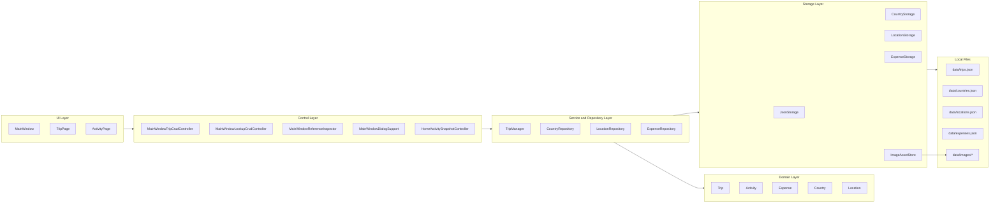
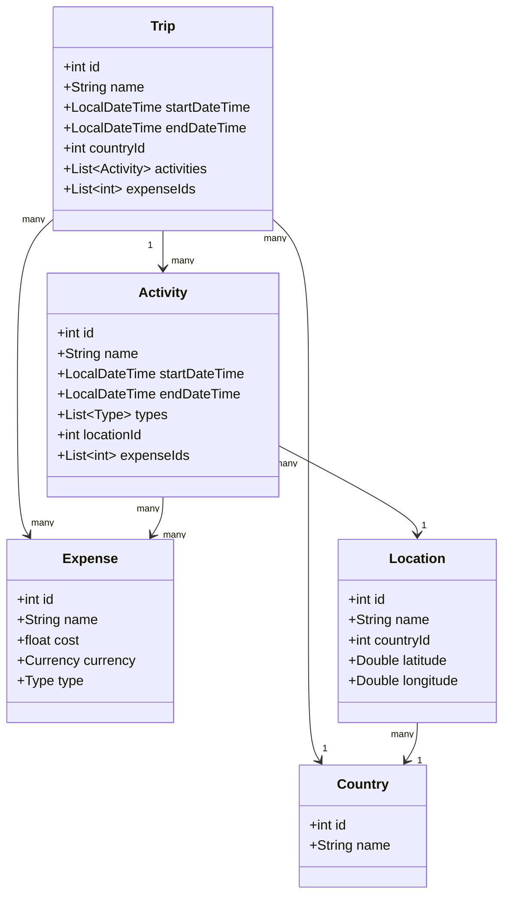
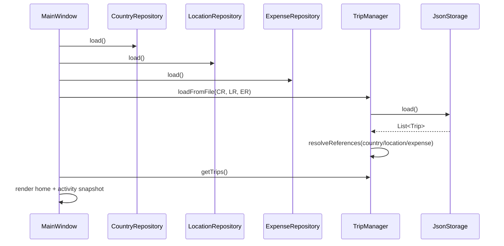
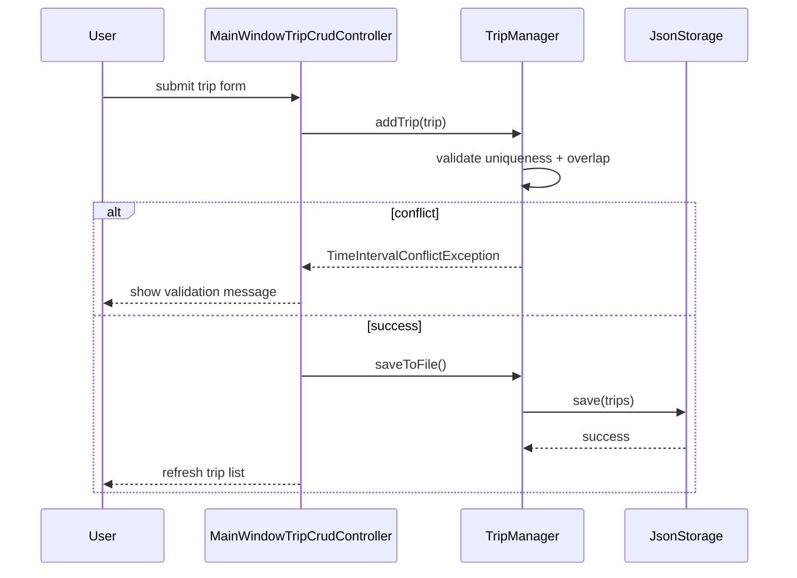
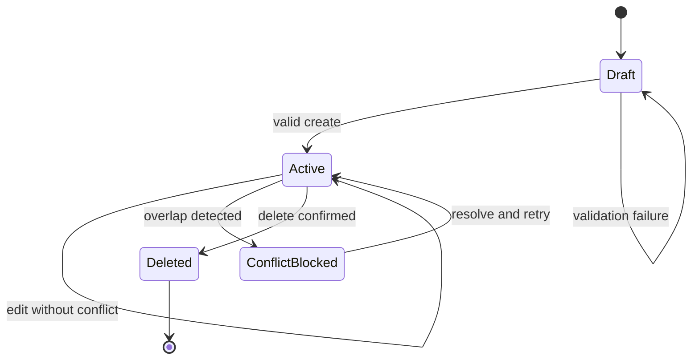
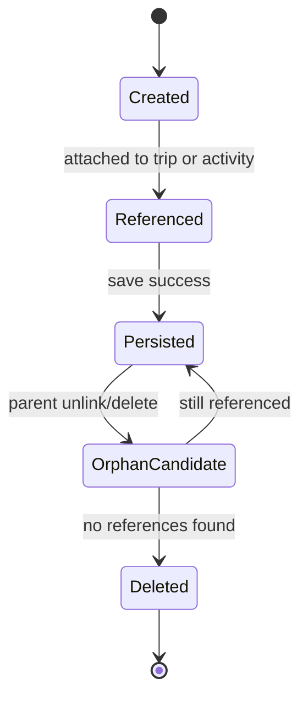

# Software Design Document (SDD)

## 1. Technical Context and Scope

### 1.1 Link to Product Context
This design implements the product direction defined in [docs/PRD.md](docs/PRD.md), specifically:
- integrated trip, activity, location, and expense planning,
- local-first persistence,
- deterministic validation and conflict handling.

### 1.2 Technical Problem Statement
The system must provide reliable, maintainable, and consistent behavior for trip planning workflows in a desktop environment, while preserving data integrity across:
- in-memory aggregate operations,
- cross-entity references,
- local JSON persistence and backward-compatible deserialization.

### 1.3 Boundaries of This Design
In scope:
- JavaFX desktop runtime architecture.
- Domain, repository, and storage design.
- In-process interface contracts and API-style contract projection for QA automation.
- Sequence/state behavior for critical flows.
- Security, performance, scalability, and observability plans.

Out of scope:
- distributed microservices migration,
- cloud synchronization,
- multi-user authentication/authorization.

## 2. Architecture Design

### 2.1 Layered Architecture
The project follows a layered monolith:
- UI layer: page controllers and JavaFX views.
- Control layer: CRUD orchestration and reference guards.
- Service/repository layer: aggregate lifecycle, lookup catalogs, indexing.
- Storage layer: JSON adapters and image asset normalization.
- Domain layer: entities, invariants, contracts.

### 2.2 Architecture Diagram



### 2.3 Architectural Rationale
Why this shape:
- keeps UI concerns separate from persistence concerns,
- allows repository-level indexing and validation,
- centralizes aggregate consistency in TripManager and domain entities,
- supports fail-soft startup with tolerant deserialization.

## 3. Data Model and Schema

### 3.1 Primary Entities

1. Trip
- id: int (non-negative)
- name: string (required)
- priority: int (non-negative)
- startDateTime: datetime
- endDateTime: datetime
- countryId: int reference
- description: nullable string
- activities: array of embedded activity payloads
- expenseIds: array<int>

2. Activity
- id: int (non-negative)
- name: string (required)
- priority: int (non-negative)
- startDateTime: datetime
- endDateTime: datetime
- description: nullable string
- types: array<enum>
- expenseIds: array<int>
- locationId: int reference

3. Expense
- id: int
- name: string
- cost: float (>= 0)
- currency: enum {SGD, USD, EUR, GBP, JPY, CNY}
- type: enum {FOOD, ACCOMMODATION, TRANSPORTATION, ENTERTAINMENT, OTHER}
- imagePath: nullable string

4. Country
- id: int
- name: string
- continent: nullable string
- imagePath: nullable string

5. Location
- id: int
- name: string
- address: nullable string
- city: nullable string
- countryId: int
- latitude: nullable double
- longitude: nullable double
- imagePath: nullable string

### 3.2 Data Relationship Diagram



### 3.3 Storage Schemas (Definitive)

Trip storage (`data/trips.json`) uses reference-based payloads:

```json
{
	"id": 1,
	"name": "Tokyo Spring Break",
	"priority": 5,
	"startDateTime": "2026-03-20T09:00:00",
	"endDateTime": "2026-03-27T23:59:00",
	"countryId": 2,
	"description": "Optional",
	"activities": [
		{
			"id": 101,
			"name": "Visit Senso-ji",
			"priority": 2,
			"startDateTime": "2026-03-21T10:00:00",
			"endDateTime": "2026-03-21T12:00:00",
			"types": ["CULTURAL"],
			"expenseIds": [1001],
			"locationId": 50
		}
	],
	"expenseIds": [2001]
}
```

Country storage (`data/countries.json`):

```json
{ "id": 2, "name": "Japan", "continent": "Asia", "imagePath": "data/images/country-japan.jpg" }
```

Location storage (`data/locations.json`):

```json
{
	"id": 50,
	"name": "Senso-ji",
	"address": "2-3-1 Asakusa",
	"city": "Tokyo",
	"countryId": 2,
	"latitude": 35.7148,
	"longitude": 139.7967,
	"imagePath": "data/images/location-senso-ji.jpg"
}
```

Expense storage (`data/expenses.json`):

```json
{ "id": 1001, "name": "Train ticket", "cost": 12.5, "currency": "JPY", "type": "TRANSPORTATION", "imagePath": null }
```

### 3.4 Indexing Strategy

1. Primary in-memory indexes
- `HashMap<Integer, Trip>` in TripManager for O(1) id lookup.
- `HashMap<Integer, Country|Location|Expense>` in repositories.

2. Uniqueness guards
- `HashSet<Integer>` for id uniqueness.
- `HashSet<String>` normalized names for duplicate prevention.

3. Complexity profile
- ID lookup: O(1) average.
- Name lookup: O(n) where map-by-name is not maintained.
- Overlap checks: O(n^2) pairwise for full overlap lists.

### 3.5 Data Migration and Compatibility

On read, storage adapters support legacy shapes:
- trip payloads with embedded `country` or legacy `location` fallback,
- trip/activity payloads with old `expenses` arrays instead of `expenseIds`,
- legacy image path aliases normalized via ImageAssetStore.

Migration strategy:
1. Deserialize tolerant input.
2. Resolve references against repositories.
3. Re-save in canonical current schema.

## 4. Interface and Contract Design

### 4.1 In-Process Contracts (Current Runtime)

Critical contract surfaces:
- TripManager: add/update/delete/find/load/save/overlap APIs.
- Repositories: CRUD + load/save + next id.
- MainWindowControl: navigation and shared orchestration actions.
- Storage adapters: load/save boundary by aggregate type.

These are the source of truth for runtime behavior in this desktop architecture.

### 4.2 Operation Contracts (In-Process)

The current project is an in-process desktop system, so contract design is defined as operation-level command/query behavior rather than HTTP endpoints.

| Operation | Input Contract | Success Contract | Failure Contract |
|---|---|---|---|
| Create Trip | name, startDateTime, endDateTime, country | Trip created, indexed, persisted, UI refreshed | Validation error, time conflict |
| Update Trip | tripId + mutable fields | Existing trip updated and persisted | Trip not found, validation error, time conflict |
| Delete Trip | tripId | Trip removed, references cleaned, persistence updated | Trip not found, persistence error |
| Add Activity | tripId + activity payload | Activity attached to trip and persisted | Trip not found, validation error |
| Add Expense | owner scope + expense payload | Expense created, attached, persisted | Validation error, persistence/image import error |
| Delete Country/Location | entity id | Delete succeeds only when no active references | Reference block, entity not found |
| Startup Load | none | Repositories loaded and references resolved | Parse warning fallback, IO failure surfaced to UI |

### 4.3 Error Contracts and Expected States

Error model used for design and QA assertions:
- `source`: component raising the error (TripManager, Repository, Storage, UI flow)
- `code`: stable category for assertions
- `message`: user-visible explanation
- `details`: optional structured context

Canonical mapping:
- `IllegalArgumentException` -> `VALIDATION_ERROR`
- `TimeIntervalConflictException` -> `TIME_CONFLICT`
- `TripNotFoundException` -> `TRIP_NOT_FOUND`
- `ActivityNotFoundException` -> `ACTIVITY_NOT_FOUND`
- `ExpenseNotFoundException` -> `EXPENSE_NOT_FOUND`
- `IOException` -> `PERSISTENCE_IO_ERROR`
- JSON parse recovery path -> `PERSISTENCE_PARSE_WARNING`

Expected behavior:
1. Validation/conflict/not-found conditions must not crash the app and must return control to the current UI flow.
2. IO failures must be surfaced through error dialogs and leave existing in-memory state consistent.
3. Parse errors during startup should fall back to empty collections with warning semantics.

## 5. Logic Flow Design

### 5.1 Sequence Diagram: Startup Load and Reference Resolution



### 5.2 Sequence Diagram: Create Trip



### 5.3 State Diagram: Trip Lifecycle



### 5.4 State Diagram: Expense Reference Lifecycle



### 5.5 Algorithm Notes

Overlap predicate (Trip/Activity):

$$
\operatorname{overlap}(x,y) = (x_{start} < y_{end}) \land (x_{end} > y_{start})
$$

Location distance (Haversine):

$$
d = 2R \arcsin\left(\sqrt{\sin^2\left(\frac{\Delta \phi}{2}\right) + \cos(\phi_1)\cos(\phi_2)\sin^2\left(\frac{\Delta \lambda}{2}\right)}\right)
$$

## 6. Cross-Cutting Concerns

### 6.1 Security

1. Data classification
- No account-level auth data in current local model.
- User-entered text and local image paths are treated as sensitive local content.

2. Controls
- Input validation in entities and services.
- Reference checks before destructive lookup deletes.
- Optional local token requirement for projected adapter APIs.

3. Gaps
- No at-rest encryption by default.
- No structured redaction policy for logs yet.

### 6.2 Performance and Scalability

Expected operating envelope:
- single-user desktop workloads,
- moderate dataset size (personal planning scale).

Bottlenecks:
- O(n^2) overlap scans,
- synchronous file IO on save,
- full-file deserialization at startup.

5x spike handling plan:
1. Introduce async save queue (background worker).
2. Add incremental caching for expensive overlap computations.
3. Introduce temp-file + atomic rename for safer writes.

### 6.3 Logging and Observability

Structured event set to log:
- `startup.load.begin|success|failure`
- `trip.create|update|delete`
- `activity.create|update|delete`
- `expense.create|update|delete|orphan_cleanup`
- `validation.error`
- `persistence.read.error|write.error`

Metrics to expose in dashboard/log summaries:
- startup load time,
- save latency,
- validation failure rates by type,
- conflict detection counts,
- orphan cleanup counts.

Alert thresholds (recommended):
- startup load failures > 3/day,
- save errors > 1% of write attempts,
- p95 save latency > 1s.

## 7. Alternatives Considered Log

| Decision Area | Chosen | Alternative Considered | Why Alternative Rejected |
|---|---|---|---|
| Persistence backend | JSON file adapters | Embedded relational DB (SQLite) | Added operational complexity for current single-user scope; defer until atomicity/query limits become critical. |
| Overlap detection | Pairwise in-memory scan | Interval tree | Higher implementation complexity for current expected data volume. |
| Expense ownership model | Canonical repository + references | Strict aggregate-owned expenses only | Reduced flexibility for shared canonical expense records and cross-reference resolution. |
| Runtime model | In-process layered monolith | Service decomposition | Not justified by scale; would increase integration and deployment cost prematurely. |

## 8. Testing and Observability Plan

### 8.1 Test Strategy

1. Unit tests
- Entity validation rules (`BaseEntity`, `Trip`, `Activity`, `Expense`).
- Overlap predicate and edge cases.
- Repository uniqueness constraints.

2. Integration tests
- Repository + storage round-trip load/save.
- JsonStorage compatibility reads for legacy payloads.
- Reference resolution correctness across country/location/expense IDs.

3. Contract tests
- In-process service contracts (TripManager/repository operations).
- Error contract and exception-to-code mapping validation.

4. End-to-end UI tests
- Create/edit/delete trip flow.
- Add activity + overlap visibility.
- Add expense + orphan cleanup behavior.

### 8.2 Test Data Sets

Minimum suites:
- Empty files/missing files.
- Valid moderate plan.
- Corrupted JSON payload.
- Legacy payload variant.
- High-density overlap dataset.

### 8.3 Observability Verification

Definition:
- Every critical write path emits success/failure event logs.
- Startup path records duration and failure reason where relevant.
- Conflict and validation events are measurable over time.

## 9. Risks and Mitigation Plan

1. Risk: write interruption can corrupt files.
- Mitigation: adopt atomic write strategy (temp file then rename).

2. Risk: schedule overlap checks become slow at high cardinality.
- Mitigation: cache sorted intervals or introduce interval index.

3. Risk: weak diagnostics in production issues.
- Mitigation: structured logs and event taxonomy from Section 6.3.

4. Risk: reference drift from legacy/partial payloads.
- Mitigation: maintain strict post-load resolution and canonical re-save path.

## 10. Definition of Done for This SDD

This SDD is complete when:

1. Peer review ready
- Another engineer can validate architecture, contracts, and logic flow and identify flaws without reading code first.

2. QA ready
- QA can derive test cases from schemas, error contracts, and sequence/state diagrams before implementation changes.

3. PM risk visibility
- Product stakeholders can identify hard parts (persistence safety, overlap performance, reference integrity) and plan release risk accordingly.

