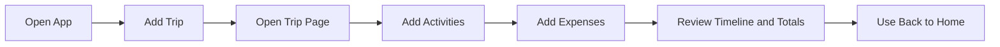

# Voyage Planner User Guide

Version: 1.0
Last Updated: 2026-04-17

## Who This Guide Is For

This guide is for users who want to plan trips, activities, and expenses using Voyage Planner.
No programming knowledge is required.

## Quick Start (First 5 Minutes)

### Step 1: Launch the app

Run one of these commands from the project root:

```bash
# Windows
gradlew.bat run

# macOS / Linux
./gradlew run
```

System reaction:
- The app opens to the Home page.
- You see `Voyage Planner`, a `Live Activity Snapshot`, and a `Trips` panel.

### Step 2: Create your first trip

User action:
1. Click `Add Trip`.
2. Fill in `Name`, `Start Date`, `Start Time`, `End Date`, `End Time`, and `Country`.
3. Click `Add`.

System reaction:
- The trip appears in the trip list.
- The trip is saved to local storage.

### Step 3: Open trip details

User action:
1. Double-click a trip card in the `Trips` list.

System reaction:
- Trip page opens.
- You can now manage timeline, activities, and expenses.

### Step 4: Add one activity

User action:
1. In the trip page, click `Add Activity`.
2. Fill in name, date/time, location (optional), and type.
3. Click `Add`.

System reaction:
- Activity appears in both the Activities list and Itinerary Timeline.

### Step 5: Add one expense

User action:
1. In the trip page, click `Add Expense`.
2. Fill in name, cost, currency, type, and optional image.
3. Click `Add`.

System reaction:
- Expense appears in the Expenses list.
- `Total Cost` is recalculated.

## Golden Path: Plan a Trip End-to-End



## Main Features

### 1. Home Page

What you can do:
- Add, edit, delete trips.
- Open a trip by double-clicking it.
- View ongoing and upcoming activities in `Live Activity Snapshot`.
- Click `?` for contextual help.

UI output example:

```text
Header: Voyage Planner
Panel: Live Activity Snapshot (Ongoing | Upcoming)
Section: Trips
Buttons: Add Trip | Edit Trip | Delete Trip
```

### 2. Trip Management

#### Add Trip

User action:
1. Click `Add Trip`.
2. Enter required values.
3. Click `Add`.

System reaction:
- Valid trip: added and saved.
- Invalid trip: error alert appears with reason.

#### Edit Trip

User action:
1. Select a trip.
2. Click `Edit Trip`.
3. Update fields.
4. Click `Save`.

System reaction:
- Trip updates and list refreshes.

#### Delete Trip

User action:
1. Select a trip.
2. Click `Delete Trip`.

System reaction:
- Trip is removed.
- Related orphan expenses are cleaned automatically.

### 3. Activity Management (Inside Trip Page)

What you can do:
- Add and edit activities.
- Filter activities by type (`ALL`, or a specific type).
- Open activity details by double-clicking an activity.
- Review overlap highlights in timeline/list.

UI output example:

```text
Trip Page sections:
- Itinerary Timeline
- Activities (with Filter by type)
- Expenses
Buttons: Add Activity | Edit Activity | Add Expense | Edit Expense | Delete Expense
```

### 4. Expense Management

You can manage expenses in two places:
- Trip page (trip-level and merged view)
- Activity page (activity-level)

User action:
1. Click `Add Expense`, `Edit Expense`, or `Delete Expense`.
2. Complete dialog inputs.

System reaction:
- Expense list updates immediately.
- Total cost updates by currency.

### 5. Country and Location Management

Countries and locations are managed from dialogs.

User action:
1. In Add/Edit Trip or Add/Edit Activity dialogs, use selector row buttons:
   - `New...`
   - `Edit...`
   - `Delete`

System reaction:
- Changes update selector options immediately.
- Deletion is blocked when the country/location is still referenced by trips/activities.

## User Action vs System Reaction (Summary)

| User Action | System Reaction |
|---|---|
| Click `Add Trip` and submit valid form | Trip is created, persisted, and shown in list |
| Submit trip with overlapping dates | Error alert: time conflict |
| Double-click trip card | Trip page opens |
| Add activity with valid range | Activity appears in list and timeline |
| Add expense | Expense saved and totals refreshed |
| Delete location that is still referenced | Error alert shows blocking references |
| Click `?` | Contextual help dialog appears for current page |

## Valid and Invalid Input Guide

### Trip

Required:
- Name
- Start date/time
- End date/time
- Country

Invalid input examples:
- Start after end
- Name already used by another trip
- Overlaps with another trip

Example error messages:
- `Invalid trip: Trip start must not be after end`
- `Trip time conflict: Trip time conflict with existing trip: ...`

### Activity

Required:
- Name
- Start date/time
- End date/time

Optional:
- Location
- Type (defaults to first selected option)

Invalid input examples:
- Start after end
- Invalid time text (fallback defaults may be applied)

Example error message:
- `Failed to edit activity: Start must not be after end`

### Expense

Required:
- Name
- Cost
- Currency
- Type

Optional:
- Image

Invalid input examples:
- Non-numeric cost
- Negative cost

Example error messages:
- `Failed to add expense: ...`
- `Failed to edit expense: ...`

## Troubleshooting and FAQ

### Q1. The app says it could not load saved data.

Cause:
- One of the JSON files in `data/` is missing, malformed, or unreadable.

What to do:
1. Back up your `data/` folder.
2. Check file content for valid JSON.
3. Restart app.

System behavior:
- The app is fail-soft and continues with available data where possible.

### Q2. I cannot delete a country/location.

Cause:
- It is still referenced by trips or activities.

What to do:
1. Remove or reassign dependent trips/activities first.
2. Retry deletion.

### Q3. My expense image does not appear.

Cause:
- File path is invalid, file was moved, or import failed.

What to do:
1. Edit the expense.
2. Re-upload image.
3. Save again.

### Q4. I clicked edit/delete but nothing happened.

Cause:
- No item is selected.

What to do:
1. Select the trip/activity/expense first.
2. Retry action.

### Q5. Timeline looks crowded.

Cause:
- Activities overlap in time.

What to do:
1. Edit activity times.
2. Use activity filter to focus by type.

## Screenshot Placeholders (For Future Capture)

Use these placeholders when preparing release-ready screenshots:

| Step | Suggested Screenshot Filename | Capture Target |
|---|---|---|
| Launch app | `ug-01-home-page.png` | Home page with `Live Activity Snapshot` and `Trips` list |
| Add first trip | `ug-02-add-trip-dialog.png` | Add Trip dialog with required fields visible |
| Open trip page | `ug-03-trip-page.png` | Trip page showing timeline, activity list, expense list |
| Add activity | `ug-04-add-activity-dialog.png` | Add Activity dialog with location/type selectors |
| Add expense | `ug-05-add-expense-dialog.png` | Add Expense dialog with currency/type/image fields |
| Lookup management | `ug-06-inline-country-location-controls.png` | `New...`, `Edit...`, `Delete` controls in selector rows |

## Data Location and Backup

Your local data is stored in:
- `data/trips.json`
- `data/countries.json`
- `data/locations.json`
- `data/expenses.json`
- `data/images/`

Backup recommendation:
1. Close the app.
2. Copy the entire `data/` folder to a backup location.

## Getting Help In-App

Use the `?` button in the top-right area of the app.
It opens page-specific guidance for Home, Trip, and Activity screens.

